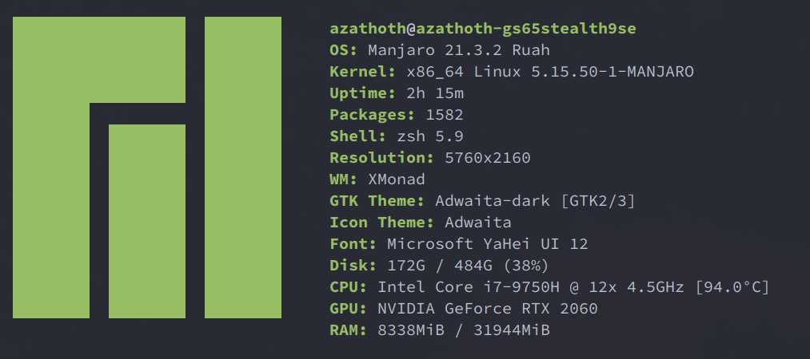
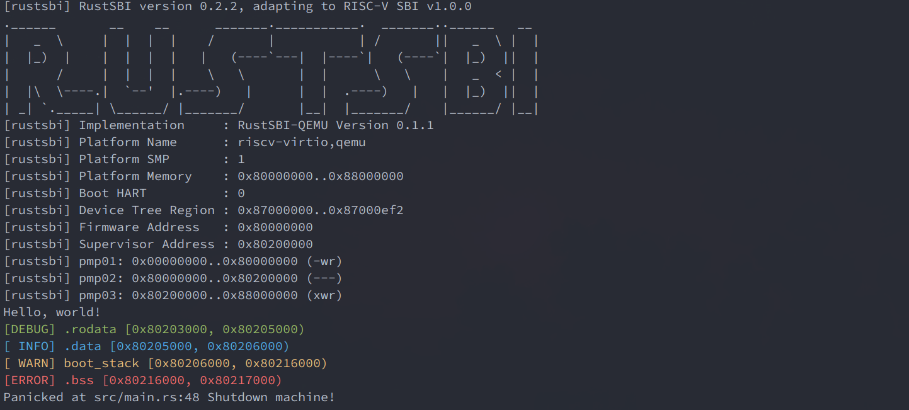
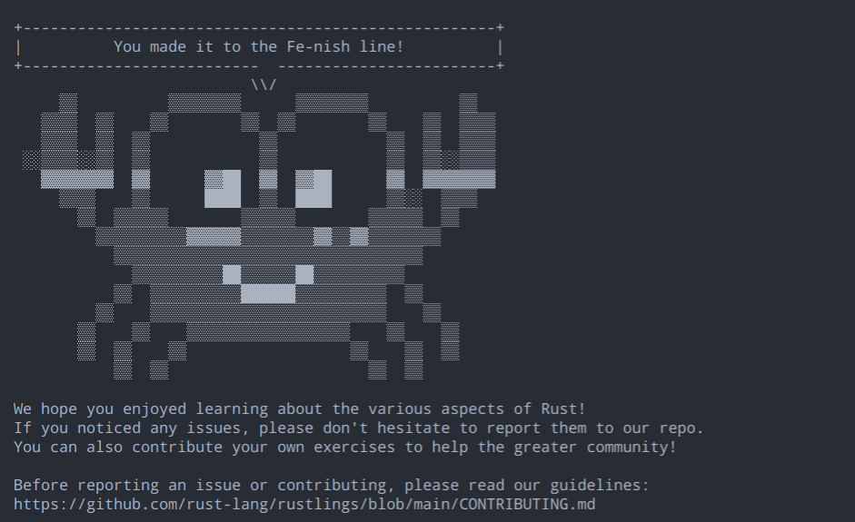

+++
title="rust os comp's daily blog"
date=2022-07-05

[taxonomies]
categories = ["Blog"]
tags = ["os", "rust", "blog"]

[extra]
toc = true
comments = true
+++

> rust 好好好!

# Intro

这里是我学习[rust-based-os-comp][rust-based-os-comp]的一个日常记录

<!-- more -->

我的个人实验环境配置:



# Blog

由于我看到训练营的通知较晚，导致我在最后一天才了解这个项目，又因为这几天还在学校实习，所以可能最近几天进度比较慢.

## 2022-07-05 (day 1)

#### Task / Progress

- 配置本地rust环境(之前已经配好)
- 尝试 `gitclassroom`, 使用 `codespace` 进行 `rustlings` 的训练
- `rustlings`:
  - `variables`
  - `functions`
  - `move_semantics`

## 2022-07-06 (day 2)

#### Task / Progress

- 第零章 实验环境配置
- 第一章 应用程序与基本执行环境(lab0-0)
- `rustlings`:
  - `primitive_types`
  - `enums`
  - `structs`

#### 实验环境配置

[第零章：实验环境配置][lab0-guide]

由于我之前接触过mit的 [6.S081][mit-6.S081], qemu已经装好([mit 6.S081的安装指引](https://pdos.csail.mit.edu/6.S081/2021/tools.html))
> 通过命令:`qemu-riscv64 -version`, 可以看出`qemu`的版本.
>
> 此外, 我用的是`manjaro`(一个基于`arch linux`的linux发行版),所以`qemu`版本较新,符合实验要求.

根据文档,clone仓库, 运行

```bash
cd os1
LOG=DEBUG make run
```

成功获得输出:



#### QA / Thinking / Reading

1. 为什么 rust 的 两个宏: `print`/`pringln` 不能被写进`core`而需要写进`std`

  > By default, all Rust crates link the standard library, which depends on the operating system for features such as threads, files, or networking. It also depends on the C standard library libc, which closely interacts with OS services. Since our plan is to write an operating system, we can not use any OS-dependent libraries. So we have to disable the automatic inclusion of the standard library through the no_std attribute.

  为了打印到标准输出, 需要与内核进行交互, 因此必然与所在平台有关

2. 为什么rust的`core` libarary能做到 platform-agnostic.

3. [Why does Rust have a "Never" primitive type?](https://stackoverflow.com/questions/51832396/why-does-rust-have-a-never-primitive-type)

4. [What is a real world example of using a unit struct?](https://stackoverflow.com/questions/67689613/what-is-a-real-world-example-of-using-a-unit-struct)
  
## 2022-07-07 (day 3)

#### Task / Progress

- 第二章 批处理系统: 看到最后一节
- `rustlings`:
  - `collections`
  - `error_handling`
  - `generics`
  - `modules`
  - `option`
  - `standard_library_types`
  - `strings`
  - `tests`
  - `threads`
  - `traits`

#### QA / Thinking / Reading

1. [rfc of associated items](https://github.com/rust-lang/rfcs/blob/master/text/0195-associated-items.md#summary)
2. [git conventional commits](https://www.conventionalcommits.org)

## 2022-07-08 (day 4)

rustlings终于写完了..

`macros`这部分的练习出的有点敷衍 😂

感觉要看懂rCore tutorial, 修改它的代码, 还得学点 `unsafe rust`,
只做 `rustlings` 和一些常规的练习感觉完全不够啊

#### Task / Progress

- 看完第二章,开始看第三章(感觉汇编部分还是有点吃力,看来得好好学下riscv了)
- 看了下 [writing an OS in rust][writing-rust-os]
- 完成 `rustlings`


#### QA / Thinking / Reading

1. [mut self and self](https://www.reddit.com/r/rust/comments/47d097/comment/d0d58fv/?utm_source=share&utm_medium=web2x&1.context=3)
2. [writing an OS in rust][writing-rust-os]

## 2022-07-09 (day 5)

今天不太想做lab...

#### Task / Progress

- 继续看 [writing an OS in rust][writing-rust-os]
- 看了一点[The Rustonomicon][Rustonomicon]

#### QA / Thinking / Reading

1. [writing an OS in rust][writing-rust-os]
2. [The Rustonomicon][Rustonomicon]

## 2022-07-10 (day 6)

今天好像没干啥...

#### Task / Progress

- 看了一下 [too-many-linked-lists][too-many-linked-lists]

#### QA / Thinking / Reading

## 2022-07-10 (day 7)

#### Task / Progress

-

#### QA / Thinking / Reading

[rust-based-os-comp]: <https://github.com/LearningOS/rust-based-os-comp2022>
[mit-6.S081]: <https://pdos.csail.mit.edu/6.S081/2021/index.html>
[lab0-guide]: <https://learningos.github.io/rust-based-os-comp2022/0setup-devel-env.html>
[writing-rust-os]: <https://os.phil-opp.com>
[Rustonomicon]: <https://doc.rust-lang.org/nomicon>
[too-many-linked-lists]: <https://rust-unofficial.github.io/too-many-lists>
